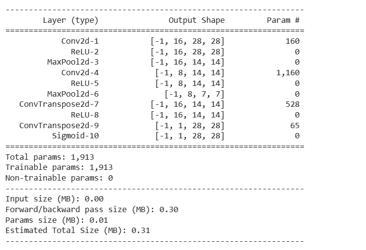
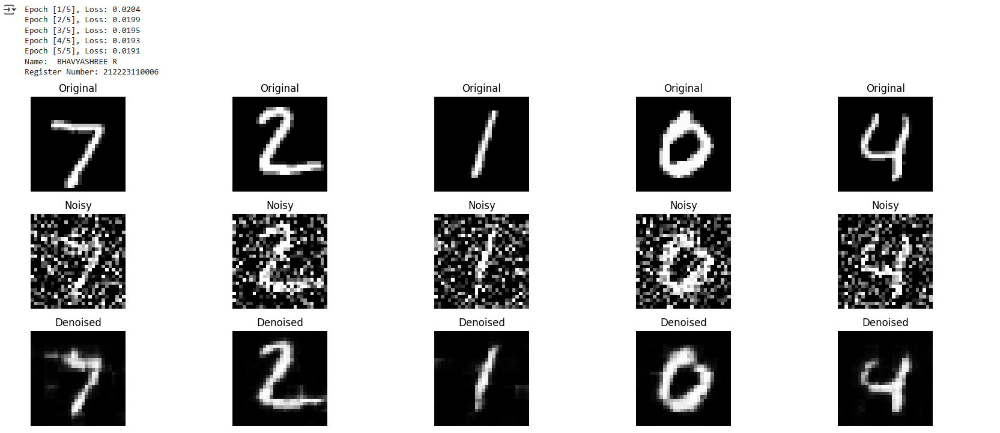

# Convolutional Autoencoder for Image Denoising

## AIM

To develop a convolutional autoencoder for image denoising application.

## Problem Statement and Dataset
Build a Convolutional Autoencoder using PyTorch to remove noise from handwritten digit images in the MNIST dataset. The goal is to train the model to learn how to recover clean images from their noisy

## DESIGN STEPS

### STEP 1: 
Import all required libraries such as PyTorch, torchvision, and other helper modules for data loading, transformation, and visualization.
### STEP 2: 
Download the MNIST dataset using torchvision.datasets, apply necessary transforms, and load it into DataLoader for batch processing.
### STEP 3: 
Define a function to add Gaussian noise to the images to simulate real-world noisy input data.
### STEP 4: 
Build the Convolutional Autoencoder using PyTorch nn.Module with separate encoder and decoder sections using Conv2d and ConvTranspose2d.
### STEP 5: 
Initialize the autoencoder model, define the loss function as MSELoss, and select Adam as the optimizer.
### STEP 6: 
Train the model over multiple epochs by feeding noisy images as input and computing the loss between the reconstructed output and the original clean image.
### STEP 7:
 Evaluate the model and visualize results by comparing original, noisy, and denoised images side by side. 

## PROGRAM
### Name: BHAVYASHREE R
### Register Number: 212223110006
```
class DenoisingAutoencoder(nn.Module):
    def __init__(self):
        super(DenoisingAutoencoder, self).__init__()
        self.encoder = nn.Sequential(
            nn.Conv2d(1, 16, kernel_size=3, stride=2, padding=1),  # -> [16, 14, 14]
            nn.ReLU(True),
            nn.Conv2d(16, 32, kernel_size=3, stride=2, padding=1), # -> [32, 7, 7]
            nn.ReLU(True)
        )
        self.decoder = nn.Sequential(
            nn.ConvTranspose2d(32, 16, kernel_size=3, stride=2, padding=1, output_padding=1), # -> [16, 14, 14]
            nn.ReLU(True),
            nn.ConvTranspose2d(16, 1, kernel_size=3, stride=2, padding=1, output_padding=1),  # -> [1, 28, 28]
            nn.Sigmoid()
        )

    def forward(self, x):
        x = self.encoder(x)
        x = self.decoder(x)
        return x

def train(model, loader, criterion, optimizer, epochs=5):
    model.train()
    for epoch in range(epochs):
        running_loss = 0.0
        for images, _ in loader:
            images = images.to(device)
            noisy_images = add_noise(images).to(device)

            # Forward pass
            outputs = model(noisy_images)
            loss = criterion(outputs, images)

            # Backward and optimize
            optimizer.zero_grad()
            loss.backward()
            optimizer.step()

            running_loss += loss.item()

        print(f"Epoch [{epoch+1}/{epochs}], Loss: {running_loss/len(loader):.4f}")
```

## OUTPUT

### Model Summary


### Original vs Noisy Vs Reconstructed Image


## RESULT
The trained autoencoder successfully removes noise from corrupted MNIST digits.